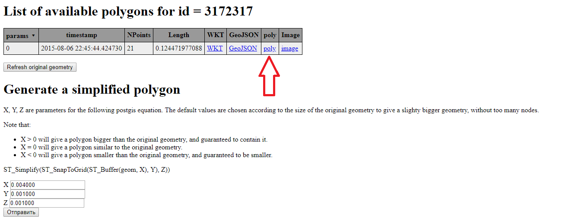

# OSM файл
## Краткое руководство по скачиванию карты
1. На официальном веб-сервисе [OpenStreetMap](https://www.openstreetmap.org/) получить `Relation ID` интересующего города.


[](https://www.openstreetmap.org/relation/3172317#map=13/59.1066/28.1247)

2. Используя `Relation ID` извлечь данные из `Poly` *(см. ниже)* с [данного ресурса](http://polygons.openstreetmap.fr/) и сохранить в созданный Вами файл `<city_name>.poly`. В моём случае: `Slantsy.poly`.


[](http://polygons.openstreetmap.fr/?id=3172317)

3. Скачать карту региона, которому принадлежит Ваш город, [здесь](https://download.geofabrik.de/russia.html) в формате **osm.pdf**. В моём случае: `Northwestern Federal District`
4. Извлечь из `*.osm.pdf` файла данные, относящиеся только к Вашему городу:
	1. Установите [Osmosis](https://wiki.openstreetmap.org/wiki/Osmosis)
	2. С помощью командной строки выполнить следующую команду: 
	
	````
    osmosis --read-pbf-fast file="*.osm.pbf" --bounding-polygon file="*.poly" --write-xml file="*.osm"
    ````
   	Пример:
    
    ````
    osmosis --read-pbf-fast file="siberian-fed-district-latest.osm.pbf" --bounding-polygon file="Slantsy.poly" --write-xml file="Slantsy.osm"
    ````
    
    3. Готово 
