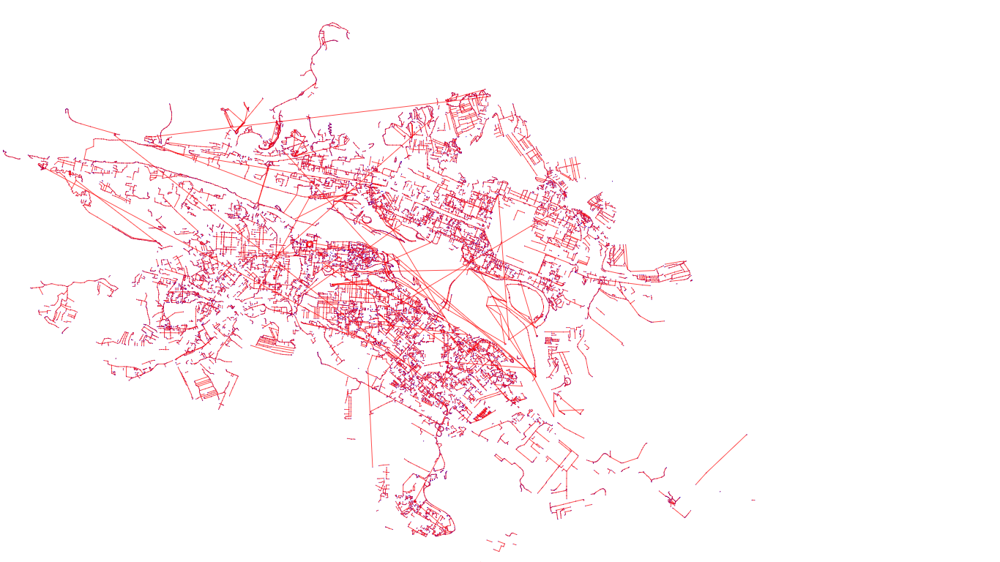

# OpenStreetMapGraph
## Задача
С условием задачи можно ознакомиться [здесь](Documentation/Task.md)
## Визуализация графа дорог, построение списка смежности на примере города Красноярск 

### Подготовительный этап

1. [Получите](Documentation/Get_OSM.md) osm файл города или скачайте готовый osm файл [отсюда](https://drive.google.com/open?id=1F7N20fHGaOksnb2hrZwUmOA4N8lpsh0a "Город Красноярск").
2. Скачанный файл поместите в директорию `Input`.

### Результаты работы программы
#### Все выходные данные можно найти в директории `Output`

Программа автоматически генерирует 3 файла:

* [`Nodes.csv`](Output/Nodes.csv) - информация о вершинах
* [`AdjList.csv`](Output/AdjList.csv) - список смежности
* [`visualization.svg`](Output/visualization.csv) - визуализация графа 

Графическая интерпретация:

